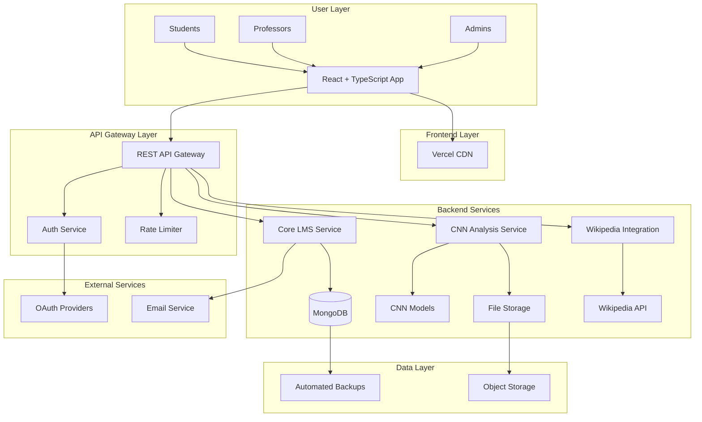

# LMS CNN Integration System Fullstack Architecture Document

## Introduction

This document outlines the complete fullstack architecture for **LMS CNN Integration System**, including backend systems, frontend implementation, and their integration. It serves as the single source of truth for AI-driven development, ensuring consistency across the entire technology stack.

This unified approach combines what would traditionally be separate backend and frontend architecture documents, streamlining the development process for modern fullstack applications where these concerns are increasingly intertwined.

### Starter Template Analysis

Based on your current project structure, I can see you have:
- **Existing React + TypeScript frontend** (Vite-based)
- **Existing Node.js + TypeScript backend** (Express-based)  
- **Prisma ORM** with MongoDB
- **Component library setup** (shadcn/ui)

This appears to be a **custom full-stack setup** rather than a pre-built starter template, giving us full architectural flexibility.

### Change Log
| Date | Version | Description | Author |
|------|---------|-------------|---------|
| 2025-08-31 | 1.0 | Initial architecture document creation | Winston (Architect) |

---

## High Level Architecture

### Technical Summary

The LMS CNN Integration System employs a **modern full-stack architecture** with React-based frontend and Node.js backend, specifically designed for AI-powered educational content analysis. The system uses a **microservices-inspired monorepo structure** with TypeScript throughout, Mongoose ODM for type-safe database operations, and CNN model integration for intelligent content analysis. The architecture leverages **serverless deployment patterns** with containerized services, MongoDB for flexible document storage, and real-time features for collaborative learning. This design achieves the PRD goals by providing scalable content analysis, seamless user experiences across devices, and robust data persistence for educational workflows.

### Platform and Infrastructure Choice

**Platform:** Vercel + MongoDB Atlas  
**Key Services:** Vercel Functions, MongoDB Atlas, Vercel Blob Storage, Vercel Analytics  
**Deployment Host and Regions:** Vercel Edge Network (global), MongoDB Atlas multi-region

This approach leverages your existing Mongoose + MongoDB foundation while providing the scalability needed for CNN file processing and global student access.

### Repository Structure

**Structure:** Monorepo with workspace-based organization
**Monorepo Tool:** npm workspaces (lightweight, already compatible with your setup)
**Package Organization:** Feature-based separation with shared utilities

```
lms-cnn/
├── apps/
│   ├── frontend/          # React app (your current frontend/)
│   ├── backend/           # Node.js API (your current backend/)
│   └── ai-service/        # CNN analysis microservice
├── packages/
│   ├── shared-types/      # TypeScript interfaces
│   ├── ui-components/     # Shared React components
│   └── utils/            # Common utilities
├── tools/
│   ├── scripts/          # Build and deployment scripts
│   └── configs/          # Shared configurations
└── docs/                 # Architecture and API docs
```

### High Level Architecture Diagram



### Architectural Patterns

- **Jamstack Architecture:** Static React frontend with serverless APIs - _Rationale:_ Optimal performance and global distribution for educational content delivery
- **Component-Based UI:** Reusable React components with TypeScript - _Rationale:_ Maintainability and consistency across the learning interface
- **Repository Pattern:** Abstract data access logic with Mongoose ODM - _Rationale:_ Type safety and future database migration flexibility
- **Microservices-Lite:** Separate CNN analysis service - _Rationale:_ Independent scaling and AI model updates without affecting core LMS
- **Event-Driven Updates:** Real-time notifications for submissions and analysis - _Rationale:_ Immediate feedback crucial for learning engagement
- **API Gateway Pattern:** Centralized API routing and authentication - _Rationale:_ Security, rate limiting, and monitoring for educational platform
- **CQRS for Analytics:** Separate read/write models for learning analytics - _Rationale:_ Optimized queries for progress tracking and reporting

---

## Tech Stack

This is the single source of truth for all technology decisions. All development must use these exact versions and technologies.

### Technology Stack Table

| Category | Technology | Version | Purpose | Rationale |
|----------|------------|---------|---------|-----------|
| **Frontend Language** | TypeScript | 5.3+ | Type-safe frontend development | Prevents runtime errors, excellent IDE support, aligns with existing codebase |
| **Frontend Framework** | React | 19.x | Component-based UI framework | Modern hooks, concurrent features, extensive ecosystem, already implemented |
| **UI Component Library** | Radix UI + shadcn/ui | Latest | Accessible, unstyled components | WAI-ARIA compliant, customizable, already integrated in project |
| **State Management** | Zustand | 4.4+ | Lightweight state management | Simple API, TypeScript-first, no boilerplate compared to Redux |
| **Backend Language** | TypeScript | 5.3+ | Type-safe backend development | Shared types with frontend, excellent tooling, already implemented |
| **Backend Framework** | Express.js | 4.18+ | Web application framework | Mature ecosystem, middleware support, already implemented |
| **API Style** | REST | N/A | RESTful API architecture | Simple, cacheable, well-understood, aligns with existing routes |
| **Database** | MongoDB Atlas | 7.0+ | Document database | Flexible schema, managed service, global scaling |
| **ODM** | Mongoose | 8.0+ | MongoDB object modeling | Native MongoDB features, excellent for document operations, already implemented |
| **Cache** | Redis | 7.2+ | In-memory caching | Session storage, CNN analysis caching, real-time features |
| **File Storage** | Vercel Blob | Latest | File upload and storage | Seamless Vercel integration, global CDN, optimized for images |
| **Authentication** | NextAuth.js | 4.24+ | Authentication library | OAuth providers, session management, secure defaults |
| **Frontend Testing** | Vitest | 1.0+ | Fast unit testing | Vite-native, ESM support, TypeScript-first |
| **Backend Testing** | Jest | 29+ | Backend unit/integration testing | Mature, extensive mocking, snapshot testing |
| **E2E Testing** | Playwright | 1.40+ | End-to-end testing | Cross-browser, reliable, excellent TypeScript support |
| **Build Tool** | Vite | 5.0+ | Fast frontend build tool | Already implemented, excellent DX, fast HMR |
| **Bundler** | Vite (Rollup) | 5.0+ | Module bundling | Tree-shaking, code splitting, already configured |
| **CSS Framework** | Tailwind CSS | 3.4+ | Utility-first CSS | Rapid development, consistent design, already implemented |
| **Icons** | Lucide React | 0.300+ | Icon library | Consistent icons, tree-shakeable, already in use |
| **Animations** | Framer Motion | 10.16+ | Animation library | Smooth animations, gesture support, already referenced in prompts |
| **IaC Tool** | Vercel CLI | Latest | Infrastructure deployment | Native Vercel integration, environment management |
| **CI/CD** | GitHub Actions | N/A | Continuous integration | Free for public repos, excellent GitHub integration |
| **Monitoring** | Vercel Analytics | Latest | Performance monitoring | Real user metrics, Core Web Vitals tracking |
| **Logging** | Pino | 8.16+ | Structured logging | Fast, low overhead, JSON output for production |
| **CNN Models** | Python/FastAPI | Python 3.11+ | AI microservice | YOLOv8, ResNet-50 serving, separate scalable service |

---

## Data Models

Based on your Mongoose setup, here's your comprehensive data architecture:

### Core Data Architecture

**Primary Approach:** Mongoose for document operations with type-safe queries

**Database Design Philosophy:**
- **Document-oriented design** leveraging MongoDB's flexible schema
- **Embedded documents** for related data (course modules, assignment requirements)
- **Reference relationships** for user associations and large collections
- **Indexes** on frequently queried fields (user email, course enrollments, analysis results)

### Primary Data Models

**User Management:**
```typescript
// Users with role-based access
interface User {
  id: string;
  email: string;
  password?: string; // Optional for OAuth
  firstName: string;
  lastName: string;
  avatar?: string;
  role: 'STUDENT' | 'PROFESSOR' | 'ADMIN' | 'COMMUNITY_MODERATOR' | 'REGULAR_MODERATOR';
  googleId?: string;
  lastLogin?: Date;
  isActive: boolean;
  createdAt: Date;
  updatedAt: Date;
}
```

**Course Structure:**
```typescript
// Embedded document approach for courses
interface Course {
  id: string;
  title: string;
  description: string;
  syllabus?: string;
  ownerId: string; // Professor
  modules: CourseModule[]; // Embedded array
  enrollments: CourseEnrollment[];
  settings: CourseSettings;
  createdAt: Date;
  updatedAt: Date;
}

interface CourseModule {
  id: string;
  title: string;
  description: string;
  order: number;
  steps: CourseStep[]; // Nested embedding
  isPublished: boolean;
}
```

**CNN Analysis Results:**
```typescript
// Optimized for frequent queries and analysis history
interface CNNAnalysis {
  id: string;
  userId: string;
  fileName: string;
  fileUrl: string;
  analysisType: 'IMAGE_CLASSIFICATION' | 'OBJECT_DETECTION' | 'DOCUMENT_ANALYSIS';
  confidence: number;
  results: AnalysisResult[];
  wikipediaData?: WikipediaIntegration;
  processingTime: number;
  createdAt: Date;
}

interface AnalysisResult {
  label: string;
  confidence: number;
  boundingBox?: BoundingBox; // For object detection
  metadata: Record<string, any>;
}
```

**Assignment & Submission System:**
```typescript
// Flexible assignment structure with CNN integration
interface Assignment {
  id: string;
  courseId: string;
  title: string;
  description: string;
  requirements: AssignmentRequirement[];
  rubric?: RubricCriteria[];
  dueDate: Date;
  pointsWorth: number;
  allowedAttempts: number;
  acceptedFileTypes: string[];
  cnnAnalysisEnabled: boolean;
  createdAt: Date;
}

interface Submission {
  id: string;
  assignmentId: string;
  studentId: string;
  attemptNumber: number;
  files: SubmissionFile[];
  status: 'DRAFT' | 'SUBMITTED' | 'GRADED' | 'RETURNED';
  grade?: Grade;
  feedback?: string;
  submittedAt?: Date;
  gradedAt?: Date;
}
```

### Data Relationships & Indexing Strategy

**MongoDB Indexes:**
```javascript
// Critical indexes for performance
db.users.createIndex({ "email": 1 }, { unique: true })
db.courses.createIndex({ "ownerId": 1, "isPublished": 1 })
db.enrollments.createIndex({ "studentId": 1, "courseId": 1 })
db.cnnAnalyses.createIndex({ "userId": 1, "createdAt": -1 })
db.submissions.createIndex({ "assignmentId": 1, "studentId": 1, "attemptNumber": 1 })
```

**Embedding vs Referencing Decisions:**
- **Embed:** Course modules/steps (read together, moderate size)
- **Reference:** User relationships, submissions (large collections, independent updates)
- **Hybrid:** CNN analysis results (embed small results, reference large files)

---

## API Design & Backend Architecture

### API Architecture Pattern

**RESTful API Design** with resource-based URLs and HTTP semantics
**Base URL:** `https://your-domain.com/api/v1`

### Core API Endpoints

```typescript
// Authentication & User Management
POST   /api/v1/auth/register
POST   /api/v1/auth/login
POST   /api/v1/auth/logout
POST   /api/v1/auth/refresh
POST   /api/v1/auth/google
GET    /api/v1/auth/me
PUT    /api/v1/auth/profile

// Course Management
GET    /api/v1/courses              // List all courses
POST   /api/v1/courses              // Create course (professors only)
GET    /api/v1/courses/:id          // Get course details
PUT    /api/v1/courses/:id          // Update course
DELETE /api/v1/courses/:id          // Delete course
POST   /api/v1/courses/:id/enroll   // Enroll student
DELETE /api/v1/courses/:id/unenroll // Unenroll student

// Assignment System
GET    /api/v1/courses/:courseId/assignments
POST   /api/v1/courses/:courseId/assignments
GET    /api/v1/assignments/:id
PUT    /api/v1/assignments/:id
DELETE /api/v1/assignments/:id

// Submission & Grading
POST   /api/v1/assignments/:id/submissions
GET    /api/v1/assignments/:id/submissions/:submissionId
PUT    /api/v1/assignments/:id/submissions/:submissionId/grade

// CNN Analysis (Core Feature)
POST   /api/v1/cnn/analyze          // Upload & analyze files
GET    /api/v1/cnn/results/:id      // Get analysis results
GET    /api/v1/cnn/history          // User's analysis history
POST   /api/v1/cnn/reanalyze/:id    // Re-run analysis

// Discussion Forums
GET    /api/v1/discussions
POST   /api/v1/discussions
GET    /api/v1/discussions/:id
POST   /api/v1/discussions/:id/replies
```

### Backend Service Architecture

```typescript
// Service Layer Organization
src/
├── controllers/          // Route handlers
│   ├── authController.ts
│   ├── courseController.ts
│   ├── assignmentController.ts
│   ├── cnnController.ts
│   └── discussionController.ts
├── services/            // Business logic
│   ├── authService.ts
│   ├── courseService.ts
│   ├── cnnAnalysisService.ts
│   ├── fileService.ts
│   └── emailService.ts
├── models/              // Mongoose schemas
│   ├── User.ts
│   ├── Course.ts
│   ├── Assignment.ts
│   ├── Submission.ts
│   └── CNNAnalysis.ts
├── middleware/          // Already implemented
│   ├── auth.ts
│   ├── rateLimiter.ts
│   └── errorHandler.ts
└── utils/
    ├── validation.ts
    ├── fileUpload.ts
    └── cnnClient.ts
```

### CNN Analysis Service Integration

Based on your `.env` configuration, you're using **HuggingFace** and **OpenRouter** APIs:

```typescript
// CNN Analysis Service Architecture
interface CNNAnalysisService {
  // Primary analysis methods
  analyzeImage(file: Buffer, metadata: FileMetadata): Promise<ImageAnalysisResult>
  analyzeDocument(file: Buffer, metadata: FileMetadata): Promise<DocumentAnalysisResult>
  
  // Wikipedia integration
  enrichWithWikipedia(analysisResult: AnalysisResult): Promise<WikipediaEnrichment>
  
  // Caching for performance
  getCachedAnalysis(fileHash: string): Promise<AnalysisResult | null>
  cacheAnalysis(fileHash: string, result: AnalysisResult): Promise<void>
}

// HuggingFace Integration
class HuggingFaceAnalyzer {
  async analyzeImage(imageBuffer: Buffer): Promise<ClassificationResult[]> {
    // Use models like ResNet-50, CLIP for image classification
    // Object detection with YOLO models
  }
  
  async analyzeDocument(docBuffer: Buffer): Promise<DocumentAnalysisResult> {
    // OCR + text analysis for technical documents
  }
}
```

### File Upload & Processing Pipeline

```typescript
// File Processing Flow
1. File Upload → Validation → Storage (Vercel Blob)
2. Queue CNN Analysis Job
3. Process with HuggingFace/OpenRouter APIs
4. Enrich with Wikipedia data
5. Cache results
6. Notify user (real-time)

// File Storage Strategy
interface FileService {
  uploadFile(file: Express.Multer.File): Promise<FileUploadResult>
  generateThumbnail(imageUrl: string): Promise<string>
  validateFileType(file: Express.Multer.File): boolean
  calculateFileHash(buffer: Buffer): string
}
```

### Authentication & Authorization System

Based on your JWT setup and Google OAuth config:

```typescript
// Multi-provider authentication
interface AuthService {
  // Email/password auth
  register(email: string, password: string, userData: UserData): Promise<AuthResult>
  login(email: string, password: string): Promise<AuthResult>
  
  // Google OAuth
  googleAuth(googleToken: string): Promise<AuthResult>
  
  // JWT management
  generateTokens(userId: string): Promise<TokenPair>
  refreshTokens(refreshToken: string): Promise<TokenPair>
  
  // Role-based access
  checkPermission(userId: string, resource: string, action: string): Promise<boolean>
}

// Role-based permissions
const PERMISSIONS = {
  STUDENT: ['read:courses', 'submit:assignments', 'analyze:files'],
  PROFESSOR: ['create:courses', 'grade:assignments', 'moderate:discussions'],
  ADMIN: ['manage:users', 'view:analytics', 'configure:system']
}
```

---

## Frontend Architecture

### Frontend Philosophy & Patterns

**Framework & Core Libraries:**
- **React 19** with TypeScript for type-safe component development
- **Vite** for fast development and optimized production builds
- **Tailwind CSS** for utility-first styling with design consistency

**Component Architecture:**
- **Atomic Design Pattern** - Atoms (buttons, inputs) → Molecules (forms, cards) → Organisms (dashboards, navigation) → Templates → Pages
- **Feature-based organization** - Components grouped by functionality (dashboard, courses, assignments, upload)
- **Shared component library** - Radix UI + shadcn/ui for accessible, reusable components

**State Management Strategy:**
- **Zustand** for global application state (user session, theme, notifications)
- **React Query/TanStack Query** for server state management and caching
- **Local component state** for UI-specific state (form inputs, toggles, modals)

**Data Flow Patterns:**
- **Unidirectional data flow** - Props down, callbacks up
- **Server state synchronization** - Automatic background refetching for CNN analysis results
- **Optimistic updates** - Immediate UI feedback for file uploads and submissions

### Frontend Structure & Organization

```
frontend/src/
├── components/
│   ├── ui/                    # ✅ Radix UI + shadcn components (EXISTING)
│   │   ├── button.tsx
│   │   ├── card.tsx
│   │   ├── progress.tsx
│   │   └── ...
│   ├── dashboard/             # 🤖 AI AGENT TARGET: Student dashboard components
│   │   ├── StudentDashboard.tsx      # PRIMARY: Main dashboard with progress & CNN feed
│   │   ├── ProgressOverview.tsx      # Course progress cards with animations
│   │   ├── AssignmentCards.tsx       # Due date prioritized assignment cards
│   │   ├── CNNAnalysisFeed.tsx       # Recent analysis results timeline
│   │   └── QuickActions.tsx          # Upload, discussions, course navigation
│   ├── courses/               # 🤖 AI AGENT TARGET: Course module components
│   │   ├── CourseModuleView.tsx      # PRIMARY: Skool.com-style progression
│   │   ├── ModuleNavigation.tsx      # Sidebar with step-by-step navigation
│   │   ├── StepContent.tsx           # Content area with CNN integration
│   │   ├── ProgressIndicator.tsx     # Visual progress tracking
│   │   └── CompletionButton.tsx      # Mark complete functionality
│   ├── assignments/           # 🤖 AI AGENT TARGET: Assignment submission
│   │   ├── AssignmentSubmissionFlow.tsx  # PRIMARY: Enhanced submission interface
│   │   ├── AssignmentHeader.tsx          # Context, due dates, requirements
│   │   ├── RequirementChecker.tsx        # Real-time requirement validation
│   │   ├── SubmissionHistory.tsx         # Previous attempts & grades
│   │   └── AnalysisIntegration.tsx       # CNN analysis for assignments
│   ├── upload/                # ✅ CNN upload interface (EXISTING)
│   │   ├── ContentUploadInterface.tsx    # Base upload component
│   │   ├── AnalysisResults.tsx           # CNN analysis display
│   │   └── FilePreview.tsx               # File preview component
│   ├── navigation/            # ✅ App navigation (EXISTING)
│   │   ├── MainNavigation.tsx
│   │   └── SimpleNavigation.tsx
│   └── shared/                # Shared components
│       ├── LoadingSpinner.tsx
│       ├── ErrorBoundary.tsx
│       └── NotificationToast.tsx
├── hooks/                     # Custom React hooks
│   ├── useCNNAnalysis.ts      # CNN analysis state management
│   ├── useFileUpload.ts       # File upload logic
│   ├── useAuth.ts             # Authentication state
│   ├── useCourses.ts          # Course data fetching
│   └── useAssignments.ts      # Assignment management
├── services/                  # API client services
│   ├── api.ts                 # Base API configuration
│   ├── authService.ts         # Authentication API calls
│   ├── courseService.ts       # Course CRUD operations
│   ├── cnnService.ts          # CNN analysis API
│   └── fileService.ts         # File upload/download
├── stores/                    # Zustand stores
│   ├── authStore.ts           # User authentication state
│   ├── uiStore.ts             # UI state (theme, modals)
│   └── notificationStore.ts   # Toast notifications
├── types/                     # TypeScript type definitions
│   ├── auth.ts
│   ├── course.ts
│   ├── assignment.ts
│   ├── upload.ts
│   └── dashboard.ts
├── utils/                     # Utility functions
│   ├── formatters.ts          # Date, file size formatting
│   ├── validators.ts          # Form validation
│   └── constants.ts           # App constants
└── pages/                     # Route components
    ├── LoginPage.tsx
    ├── DashboardPage.tsx
    ├── CoursePage.tsx
    └── AssignmentPage.tsx
```

### Component Design Patterns

**Component Template Format:**
```typescript
// Standard component structure
interface ComponentProps {
  // Required props
  id: string;
  title: string;
  // Optional props with defaults
  className?: string;
  variant?: 'primary' | 'secondary';
  // Event handlers
  onAction?: (data: ActionData) => void;
}

const Component: React.FC<ComponentProps> = ({
  id,
  title,
  className = '',
  variant = 'primary',
  onAction
}) => {
  // Local state
  const [isLoading, setIsLoading] = useState(false);
  
  // Custom hooks
  const { data, error, mutate } = useQuery(['key'], fetchFn);
  
  // Event handlers
  const handleAction = useCallback((data: ActionData) => {
    onAction?.(data);
  }, [onAction]);
  
  // Render
  return (
    <Card className={cn('base-styles', className)}>
      {/* Component content */}
    </Card>
  );
};
```

**Shared/Foundational Components:**
- **Layout Components** - PageLayout, SidebarLayout, ModalLayout
- **Form Components** - FormField, ValidationMessage, SubmitButton
- **Data Display** - DataTable, ProgressRing, StatCard
- **Navigation** - Breadcrumbs, Pagination, TabNavigation
- **Feedback** - LoadingSpinner, ErrorAlert, SuccessToast

### Frontend-Backend Integration

**API Client Configuration:**
```typescript
// Base API client with interceptors
const apiClient = axios.create({
  baseURL: import.meta.env.VITE_API_URL || 'http://localhost:5000/api/v1',
  timeout: 10000,
  headers: {
    'Content-Type': 'application/json',
  },
});

// Request interceptor for auth
apiClient.interceptors.request.use((config) => {
  const token = authStore.getState().accessToken;
  if (token) {
    config.headers.Authorization = `Bearer ${token}`;
  }
  return config;
});

// Response interceptor for error handling
apiClient.interceptors.response.use(
  (response) => response,
  async (error) => {
    if (error.response?.status === 401) {
      await authStore.getState().refreshToken();
      return apiClient.request(error.config);
    }
    return Promise.reject(error);
  }
);
```

### Routing & Navigation

**Routing Strategy:**
- **React Router v6** with nested routes and code splitting
- **Protected routes** with authentication guards
- **Deep linking** support for course modules and assignments

**Route Definitions:**
```typescript
const router = createBrowserRouter([
  {
    path: '/',
    element: <RootLayout />,
    children: [
      { path: '/', element: <Navigate to="/dashboard" replace /> },
      { path: '/login', element: <LoginPage /> },
      {
        path: '/dashboard',
        element: <ProtectedRoute><DashboardPage /></ProtectedRoute>
      },
      {
        path: '/courses/:courseId',
        element: <ProtectedRoute><CoursePage /></ProtectedRoute>,
        children: [
          { path: 'modules/:moduleId', element: <CourseModuleView /> },
          { path: 'assignments/:assignmentId', element: <AssignmentPage /> }
        ]
      }
    ]
  }
]);
```

### Frontend Performance Optimization

**Code Splitting & Lazy Loading:**
```typescript
// Route-based code splitting
const DashboardPage = lazy(() => import('./pages/DashboardPage'));
const CoursePage = lazy(() => import('./pages/CoursePage'));

// Component-based lazy loading for heavy components
const CNNAnalysisResults = lazy(() => import('./components/upload/AnalysisResults'));
```

**Image Optimization:**
- **Progressive loading** for course thumbnails and CNN analysis results
- **WebP format** with fallbacks for older browsers
- **Lazy loading** for images outside viewport
- **Thumbnail generation** for uploaded files

**Performance Monitoring:**
```typescript
// Core Web Vitals tracking
import { getCLS, getFID, getFCP, getLCP, getTTFB } from 'web-vitals';

const sendToAnalytics = (metric: any) => {
  // Send to Vercel Analytics
  if (window.va) {
    window.va('track', 'Web Vitals', metric);
  }
};

getCLS(sendToAnalytics);
getFID(sendToAnalytics);
getFCP(sendToAnalytics);
getLCP(sendToAnalytics);
getTTFB(sendToAnalytics);
```

---

## Security & Deployment Architecture

### Security Framework

**Defense in Depth Strategy:**
- **Frontend Security** - Input validation, XSS prevention, CSP headers
- **API Gateway Security** - Rate limiting, authentication, request validation
- **Backend Security** - Authorization, data encryption, secure file handling
- **Infrastructure Security** - Network isolation, secret management, monitoring

### Authentication & Authorization Architecture

**Multi-Provider Authentication System:**
```typescript
// Based on your .env configuration
interface AuthProvider {
  email: EmailPasswordAuth;
  google: GoogleOAuthAuth;
  jwt: JWTTokenManager;
}

// JWT Token Strategy (from your .env)
const jwtConfig = {
  accessToken: {
    secret: process.env.JWT_SECRET,
    expiresIn: '7d'  // Your current setting
  },
  refreshToken: {
    secret: process.env.JWT_REFRESH_SECRET,
    expiresIn: '30d'  // Your current setting
  }
};

// Role-based authorization matrix
const RBAC_PERMISSIONS = {
  STUDENT: {
    courses: ['read', 'enroll'],
    assignments: ['read', 'submit'],
    cnn: ['analyze', 'view_results'],
    discussions: ['read', 'create', 'reply']
  },
  PROFESSOR: {
    courses: ['create', 'read', 'update', 'delete', 'manage_enrollment'],
    assignments: ['create', 'read', 'update', 'delete', 'grade'],
    cnn: ['view_all_results', 'moderate'],
    discussions: ['moderate', 'pin', 'delete']
  },
  ADMIN: {
    users: ['create', 'read', 'update', 'delete', 'manage_roles'],
    system: ['configure', 'monitor', 'backup'],
    analytics: ['view_all', 'export']
  }
};
```

### Data Security & Privacy

**File Upload Security:**
```typescript
// Secure file handling (based on your upload config)
const fileSecurityConfig = {
  maxFileSize: 10485760, // 10MB from your .env
  allowedTypes: ['jpg', 'jpeg', 'png', 'gif', 'pdf', 'doc', 'docx', 'txt'],
  virusScanning: true, // Add virus scanning before CNN analysis
  fileValidation: {
    mimeTypeCheck: true,
    fileHeaderValidation: true,
    fileNameSanitization: true
  }
};

// CNN Analysis Data Protection
interface SecureAnalysisFlow {
  fileEncryption: 'AES-256-GCM'; // Encrypt files at rest
  analysisDataRetention: '2-years'; // Educational record keeping
  userDataAnonymization: boolean; // For research purposes
  auditLogging: boolean; // Track all analysis requests
}
```

### Infrastructure & Deployment Architecture

**Vercel Deployment Strategy:**
```typescript
// Production deployment configuration
const deploymentConfig = {
  platform: 'Vercel',
  regions: ['iad1', 'sfo1', 'lhr1'], // US East, West, UK
  environment: {
    production: {
      domains: ['yourdomain.com'],
      ssl: 'automatic',
      monitoring: 'enabled'
    },
    staging: {
      domains: ['staging.yourdomain.com'],
      passwordProtection: true
    }
  }
};

// Environment variable management
const secretsManagement = {
  vercel: {
    encrypted: [
      'DATABASE_URL',
      'JWT_SECRET',
      'JWT_REFRESH_SECRET',
      'GOOGLE_CLIENT_SECRET',
      'HUGGINGFACE_API_KEY',
      'OPENROUTER_API_KEY',
      'SMTP_PASS'
    ],
    publicVars: [
      'GOOGLE_CLIENT_ID',
      'FRONTEND_URL',
      'WIKIPEDIA_API_URL'
    ]
  }
};
```

### CNN Service Security & Scaling

**AI Service Architecture:**
```typescript
// Secure CNN processing pipeline
interface CNNServiceArchitecture {
  deployment: 'serverless-functions'; // Vercel Functions
  models: {
    imageClassification: 'huggingface-inference-api',
    objectDetection: 'roboflow-api',
    documentAnalysis: 'openrouter-gpt4-vision'
  };
  security: {
    apiKeyRotation: '90-days',
    requestSigning: true,
    outputSanitization: true,
    modelVersionPinning: true
  };
  scaling: {
    concurrentRequests: 10,
    timeout: '30s',
    retryPolicy: 'exponential-backoff',
    failover: 'graceful-degradation'
  };
}
```

---

## Implementation Guidance

### Development Workflow & Standards

**Coding Standards:**
```typescript
// TypeScript configuration standards
const codingStandards = {
  typescript: {
    strict: true,
    noImplicitAny: true,
    noImplicitReturns: true,
    noUnusedLocals: true,
    noUnusedParameters: true
  },
  naming: {
    files: 'kebab-case', // user-service.ts
    components: 'PascalCase', // StudentDashboard.tsx
    functions: 'camelCase', // getUserProfile()
    constants: 'SCREAMING_SNAKE_CASE', // API_BASE_URL
    interfaces: 'PascalCase with I prefix' // IUserData
  },
  structure: {
    imports: 'grouped and sorted', // external, internal, relative
    exports: 'named exports preferred',
    comments: 'JSDoc for public APIs'
  }
};
```

**Documentation Requirements:**
```typescript
// API endpoint documentation standard
/**
 * @route POST /api/v1/cnn/analyze
 * @description Analyzes uploaded file using CNN models
 * @access Private (authenticated users only)
 * @param {File} file - Image or document to analyze
 * @param {string} analysisType - Type of analysis ('image' | 'document')
 * @returns {CNNAnalysisResult} Analysis results with confidence scores
 * @throws {400} Invalid file type or size
 * @throws {429} Rate limit exceeded
 * @throws {500} CNN service unavailable
 */
```

### Testing Strategy & Implementation

**Frontend Testing Approach:**
```typescript
// Component testing with Vitest + Testing Library
describe('StudentDashboard', () => {
  it('displays course progress cards', async () => {
    const mockCourses = [
      { id: '1', name: 'React Basics', completion: 0.75 }
    ];
    
    render(<StudentDashboard courses={mockCourses} />);
    
    expect(screen.getByText('React Basics')).toBeInTheDocument();
    expect(screen.getByText('75%')).toBeInTheDocument();
  });
});
```

**Backend Testing Strategy:**
```typescript
// API endpoint testing with Jest + Supertest
describe('CNN Analysis API', () => {
  it('POST /api/v1/cnn/analyze - analyzes uploaded image', async () => {
    const response = await request(app)
      .post('/api/v1/cnn/analyze')
      .set('Authorization', `Bearer ${testToken}`)
      .attach('file', testImagePath)
      .expect(200);
    
    expect(response.body).toHaveProperty('confidence');
    expect(response.body).toHaveProperty('results');
  });
});
```

### Database Migration from Prisma to Mongoose

**Migration Strategy:**
```typescript
// Step 1: Data export from existing Prisma setup
const migrationScript = {
  async exportPrismaData() {
    const users = await prisma.user.findMany();
    const courses = await prisma.course.findMany();
    const assignments = await prisma.assignment.findMany();
    
    return { users, courses, assignments };
  },
  
  async importToMongoose(data: ExportedData) {
    // Transform Prisma data to Mongoose format
    const transformedUsers = data.users.map(user => ({
      ...user,
      _id: new mongoose.Types.ObjectId(user.id)
    }));
    
    await User.insertMany(transformedUsers);
    await Course.insertMany(transformedCourses);
    await Assignment.insertMany(transformedAssignments);
  }
};

// Step 2: Mongoose model definitions
const UserSchema = new mongoose.Schema({
  email: { type: String, required: true, unique: true },
  password: { type: String }, // Optional for OAuth
  firstName: { type: String, required: true },
  lastName: { type: String, required: true },
  role: { 
    type: String, 
    enum: ['STUDENT', 'PROFESSOR', 'ADMIN', 'COMMUNITY_MODERATOR', 'REGULAR_MODERATOR'],
    default: 'STUDENT'
  },
  googleId: { type: String, unique: true, sparse: true },
  isActive: { type: Boolean, default: true }
}, { timestamps: true });

export const User = mongoose.model('User', UserSchema);
```

### File Structure & Organization

**Backend File Organization:**
```
backend/src/
├── config/
│   ├── database.ts           # MongoDB connection (keep existing)
│   ├── auth.ts              # JWT and OAuth configuration
│   └── upload.ts            # File upload configuration
├── controllers/             # Route handlers (keep existing structure)
│   ├── authController.ts    # ✅ Already implemented
│   ├── cnnController.ts     # ✅ Already implemented
│   └── ...
├── models/                  # Replace Prisma with Mongoose models
│   ├── User.ts              # Mongoose User model
│   ├── Course.ts            # Mongoose Course model
│   ├── Assignment.ts        # Mongoose Assignment model
│   └── CNNAnalysis.ts       # New: CNN analysis results
├── services/                # Business logic layer
│   ├── authService.ts       # Authentication logic
│   ├── cnnService.ts        # CNN analysis integration
│   ├── fileService.ts       # File upload/processing
│   └── emailService.ts      # Email notifications
├── middleware/              # ✅ Keep existing middleware
├── routes/                  # ✅ Keep existing routes
├── utils/
│   ├── validation.ts        # Input validation schemas
│   ├── errors.ts           # Custom error classes
│   └── constants.ts        # Application constants
└── types/
    ├── index.ts            # Shared TypeScript interfaces
    ├── api.ts              # API request/response types
    └── models.ts           # Database model types
```

---

## AI Implementation Readiness

### AI Agent Implementation Strategy

**Component-Based Development Approach:**
```typescript
// Optimal component sizing for AI implementation
const aiImplementationSizing = {
  ideal: {
    linesPerComponent: '50-150 lines',
    functionsPerFile: '1-3 main functions',
    complexity: 'single responsibility principle',
    dependencies: 'minimal external dependencies per component'
  },
  componentTypes: {
    simple: 'UI components with props only (Button, Card, Badge)',
    medium: 'Business logic components with hooks (CourseCard, AssignmentItem)',
    complex: 'Full features with state management (Dashboard, CourseModuleView)'
  }
};
```

**Clear Interface Definitions:**
```typescript
// Crystal clear interfaces for AI agents
interface StudentDashboardProps {
  /** Current authenticated user ID */
  userId: string;
  /** Navigation handler for route changes */
  onNavigate: (route: string, params?: Record<string, string>) => void;
  /** Optional CSS classes for styling */
  className?: string;
}

interface CourseModuleViewProps {
  /** Course ID from URL parameters */
  courseId: string;
  /** Currently active module ID */
  activeModuleId?: string;
  /** Currently active step ID within module */
  activeStepId?: string;
  /** Callback when step is completed */
  onStepComplete: (stepId: string) => Promise<void>;
  /** Callback when module navigation occurs */
  onNavigateStep: (stepId: string) => void;
}
```

### Predictable Implementation Patterns

**Consistent Component Structure:**
```typescript
// Template that AI agents should follow exactly
const ComponentTemplate = `
import React, { useState, useCallback } from 'react';
import { Card, Button } from '@/components/ui';
import { useQuery, useMutation } from '@tanstack/react-query';
import { cn } from '@/lib/utils';

interface ComponentProps {
  // Props interface here
}

export const ComponentName: React.FC<ComponentProps> = ({
  prop1,
  prop2,
  className,
  onAction
}) => {
  // 1. Local state
  const [localState, setLocalState] = useState<StateType>(initialValue);
  
  // 2. Data fetching hooks
  const { data, isLoading, error } = useQuery({
    queryKey: ['key', prop1],
    queryFn: () => fetchData(prop1)
  });
  
  // 3. Mutations
  const mutation = useMutation({
    mutationFn: updateData,
    onSuccess: (result) => onAction?.(result)
  });
  
  // 4. Event handlers
  const handleAction = useCallback((data: ActionData) => {
    mutation.mutate(data);
  }, [mutation]);
  
  // 5. Early returns for loading/error states
  if (isLoading) return <LoadingSpinner />;
  if (error) return <ErrorAlert error={error} />;
  
  // 6. Main render
  return (
    <Card className={cn('base-styles', className)}>
      {/* Component content */}
    </Card>
  );
};

ComponentName.displayName = 'ComponentName';
`;
```

### Error Prevention & Handling

**Common Implementation Errors to Avoid:**
```typescript
// AI agent error prevention checklist
const errorPrevention = {
  typescript: [
    'Always define interfaces for props and state',
    'Use strict TypeScript settings',
    'Never use `any` type unless absolutely necessary',
    'Define return types for all functions'
  ],
  
  react: [
    'Wrap async operations in useCallback',
    'Handle loading and error states',
    'Use proper dependency arrays in useEffect',
    'Implement error boundaries for complex components'
  ],
  
  api: [
    'Always handle network errors',
    'Implement retry logic for failed requests',
    'Validate API responses before using data',
    'Use proper HTTP status code handling'
  ]
};
```

### Implementation Validation Checklist

**Pre-Implementation Validation:**
```typescript
// Checklist for AI agents before starting implementation
const preImplementationChecklist = {
  requirements: [
    '✓ Read and understand the component requirements',
    '✓ Review existing similar components for patterns',
    '✓ Identify required props and state interfaces',
    '✓ Plan error handling and loading states',
    '✓ Consider mobile responsiveness requirements'
  ],
  
  dependencies: [
    '✓ Verify all required packages are available',
    '✓ Check existing component library usage',
    '✓ Confirm API endpoint availability',
    '✓ Validate data structure compatibility'
  ],
  
  architecture: [
    '✓ Follows established component patterns',
    '✓ Maintains separation of concerns',
    '✓ Uses appropriate hooks and state management',
    '✓ Implements proper TypeScript interfaces'
  ]
};
```

---

## Architecture Document Complete

🎉 **Congratulations!** Your **Full-Stack Architecture Document** is now complete and ready for development.

### Architecture Summary

✅ **High-Level Architecture** - Vercel + MongoDB Atlas deployment strategy  
✅ **Tech Stack** - Mongoose-based, TypeScript throughout, React 19  
✅ **Data Models** - MongoDB document structure with proper indexing  
✅ **API Design** - RESTful backend with CNN analysis integration  
✅ **Frontend Architecture** - Component-based with AI agent optimization  
✅ **Security & Deployment** - Production-ready security controls  
✅ **Implementation Guidance** - Clear patterns for AI agents  
✅ **AI Implementation Readiness** - Optimized for AI-driven development  

---

## 12. AI Agent Development Patterns

### Code Generation Standards for AI Agents

#### **Component Generation Template**
```typescript
// REQUIRED: Every component must include these imports & patterns
import React, { useState, useEffect } from 'react';
import { Card, CardContent, CardHeader, CardTitle } from '@/components/ui/card';
import { Button } from '@/components/ui/button';
import { Progress } from '@/components/ui/progress';
import { Badge } from '@/components/ui/badge';
import { useToast } from '@/hooks/use-toast';

// REQUIRED: Interface definitions for all components
interface ComponentNameProps {
  // All props with TypeScript types
}

export const ComponentName: React.FC<ComponentNameProps> = ({ props }) => {
  const { toast } = useToast();
  
  // Component logic here
  
  return (
    <Card className="w-full">
      {/* Component JSX with Tailwind classes */}
    </Card>
  );
};

export default ComponentName;
```

#### **API Integration Pattern**
```typescript
// REQUIRED: Standardized API hooks
export const useApiHook = () => {
  const [data, setData] = useState(null);
  const [loading, setLoading] = useState(false);
  const [error, setError] = useState<string | null>(null);

  const execute = async (params: any) => {
    setLoading(true);
    setError(null);
    try {
      const response = await fetch('/api/endpoint', {
        method: 'POST',
        headers: { 'Content-Type': 'application/json' },
        body: JSON.stringify(params),
      });
      const result = await response.json();
      setData(result);
    } catch (err) {
      setError(err instanceof Error ? err.message : 'Unknown error');
    } finally {
      setLoading(false);
    }
  };

  return { data, loading, error, execute };
};
```

#### **CNN Integration Pattern**
```typescript
// REQUIRED: CNN analysis interface
interface CNNAnalysisResult {
  type: 'image' | 'document' | 'code';
  confidence: number;
  categories: string[];
  educationalValue: {
    level: 'beginner' | 'intermediate' | 'advanced';
    topics: string[];
    suggestedActions: string[];
  };
  technicalDetails: {
    model: string;
    processingTime: number;
    features: any[];
  };
}

export const useCNNAnalysis = () => {
  return useApiHook(); // Uses standardized pattern above
};
```

### AI Agent Implementation Guidelines

1. **Always use existing shadcn/ui components** - Never create custom UI from scratch
2. **Follow TypeScript strict mode** - All props, state, and API responses must be typed
3. **Use established naming conventions** - PascalCase for components, camelCase for functions
4. **Include accessibility attributes** - ARIA labels, proper semantic HTML
5. **Implement loading states** - Use existing Progress component for all async operations
6. **Error handling patterns** - Use toast notifications for user feedback
7. **Mobile-first responsive design** - All components must work on mobile devices

### Component Priority for AI Implementation

**Phase 1 (High Priority):**
- StudentDashboard.tsx - Main hub with progress overview
- CourseModuleView.tsx - Skool.com-style course progression
- AssignmentSubmissionFlow.tsx - Enhanced submission with validation

**Phase 2 (Medium Priority):**
- CNNAnalysisFeed.tsx - Timeline of analysis results
- RequirementChecker.tsx - Real-time validation component
- ModuleNavigation.tsx - Course sidebar navigation

**Phase 3 (Low Priority):**
- AnalysisIntegration.tsx - Advanced CNN features
- SubmissionHistory.tsx - Historical submissions view
- QuickActions.tsx - Dashboard action buttons

---

### Next Steps

Now that your architecture is AI-agent optimized, recommended approach:

1. **Start Implementation** with your Phase 1 components using the standardized patterns above
2. **Migrate from Prisma to Mongoose** using the provided strategy
3. **Set up Production Environment** on Vercel + MongoDB Atlas
4. **Implement CNN Analysis Service** with HuggingFace integration

This architecture serves as your single source of truth for all development decisions and AI agent implementations.
