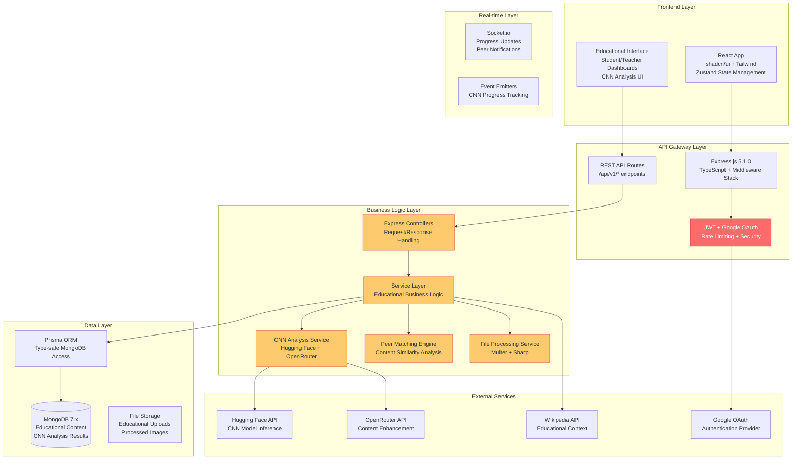
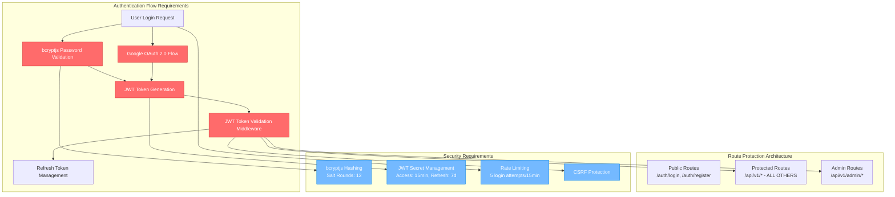

# LMS CNN Integration Backend Architecture Document

## Change Log

| Date | Version | Description | Author |
|------|---------|-------------|---------|
| 2025-08-31 | 1.0 | Initial backend architecture document | Winston (Architect) |
| 2025-08-31 | 1.1 | **CRITICAL UPDATE**: Authentication system reconstruction required as foundational prerequisite | Winston (Architect) |

## Introduction

This document outlines the overall project architecture for **LMS CNN Integration**, including backend systems, shared services, and non-UI specific concerns. Its primary goal is to serve as the guiding architectural blueprint for AI-driven development, ensuring consistency and adherence to chosen patterns and technologies.

**🚨 CRITICAL ARCHITECTURAL STATUS UPDATE 🚨**

**Authentication System Status: BROKEN/INCOMPLETE - RECONSTRUCTION REQUIRED**

The current authentication functionality is non-functional and must be completely reconstructed before any feature development can proceed. This includes:

- JWT token generation and validation
- User registration and login flows  
- Password hashing and verification
- Google OAuth integration
- Session management and middleware
- API route protection

**IMPACT**: All EPIC 1 stories are **BLOCKED** until authentication reconstruction is complete. No user-facing features can be safely implemented without functional authentication.

**Relationship to Frontend Architecture:**
The project includes a comprehensive React-based user interface documented in the Frontend Architecture Document, which details the frontend-specific design and MUST be used in conjunction with this document. Core technology stack choices documented herein are definitive for the entire project, including frontend API integration patterns.

## Starter Template or Existing Project

**Analysis of Current Foundation:**
This project is based on a **custom full-stack TypeScript setup** with a well-organized monorepo structure. The foundation includes:

- **Backend**: Node.js + Express.js 5.1.0 + TypeScript with MongoDB via Prisma
- **Frontend**: React + Vite + TypeScript with shadcn/ui component system  
- **Database**: MongoDB with comprehensive Prisma schema for educational data
- **Authentication**: JWT + bcryptjs with Google OAuth integration
- **File Processing**: Multer + Sharp for image upload and CNN preprocessing

**Rationale:** This custom setup provides maximum flexibility for CNN integration requirements and avoids constraints from opinionated starter templates. The MongoDB choice is particularly well-suited for storing variable CNN analysis results and flexible educational content schemas.

**Decision**: **N/A** - Custom foundation already established and optimal for project requirements.

# High Level Architecture

## Technical Summary

The LMS CNN Integration backend employs a **modular monolithic Node.js architecture** using Express.js 5.1.0 with TypeScript for comprehensive type safety. The system leverages **MongoDB** through Prisma ORM for flexible document storage, perfectly suited for variable CNN analysis results and educational content. Core architectural patterns include service layer abstraction, middleware-based security, and event-driven CNN processing with real-time progress updates. The architecture supports intelligent content analysis, automated peer matching, and bidirectional knowledge sharing through a robust REST API that serves the React frontend while maintaining clear separation between educational content management and AI processing workflows.

## High Level Overview

1. **Architectural Style**: **Modular Monolith** - Single Express.js application with clear internal boundaries, optimized for educational workflow complexity
2. **Repository Structure**: **Monorepo** - Frontend and backend unified for streamlined development, matching existing project structure
3. **Service Architecture**: **Layered Architecture** with controllers, services, and MongoDB data layer via Prisma
4. **Primary User Flow**: Student uploads → Multer file handling → Sharp preprocessing → CNN analysis → MongoDB result storage → Real-time updates → Peer matching → Knowledge recommendations
5. **Key Architectural Decisions**:
   - **MongoDB + Prisma** for flexible educational content and CNN result storage
   - **Express.js 5.1.0** with comprehensive middleware stack (security, validation, rate limiting)
   - **JWT + Google OAuth** for stateless authentication with social login
   - **External AI API integration** for cost-effective CNN analysis
   - **Event-driven real-time updates** for progress tracking and collaboration

## High Level Project Diagram


    Services --> WebSockets
    WebSockets --> React
    FileService --> FileStorage
```

## 🚨 CRITICAL: Authentication Architecture Requirements

### Current State Analysis
**Status**: Authentication system is **NON-FUNCTIONAL** and requires complete reconstruction

**Identified Issues**:
- JWT token generation/validation broken
- Password hashing implementation incomplete  
- Google OAuth integration non-functional
- Route protection middleware failing
- User session management broken
- API security compromised

### Required Authentication Architecture



### BLOCKING DEPENDENCIES

**All EPIC 1 stories require functional authentication. The following components are BLOCKED:**

1. **Database Schema Enhancement (Story 1.1)** - Cannot create user analytics without user authentication
2. **AI Model Service Infrastructure (Story 1.2)** - Cannot secure AI services without authentication middleware  
3. **WebSocket Infrastructure (Story 1.3)** - Cannot authenticate WebSocket connections
4. **Analytics Data Collection (Story 1.4)** - Cannot collect user-specific analytics without user identification
5. **All subsequent stories (1.5-1.9)** - All require authenticated user context

### RECONSTRUCTION PRIORITY REQUIREMENTS

**Must be completed BEFORE any other development:**

1. **JWT Token System** - Complete token generation, validation, and refresh logic
2. **Password Security** - bcryptjs hashing with proper salt rounds  
3. **Google OAuth Integration** - Full OAuth 2.0 flow with profile management
4. **Route Protection Middleware** - Secure all API endpoints except public auth routes
5. **Session Management** - Proper token expiration and refresh handling
6. **Security Hardening** - Rate limiting, CSRF protection, input validation

**ESTIMATED RECONSTRUCTION TIME**: 3-5 days for complete authentication rebuild

## Architectural and Design Patterns

Based on the existing MongoDB + Express.js + TypeScript foundation and CNN analysis requirements:

- **Service Layer Pattern:** Centralized business logic with clear separation from controllers - *Rationale:* Essential for complex educational workflows and CNN analysis orchestration, promotes testability and code reuse
- **Repository Pattern via Prisma:** Type-safe data access abstraction over MongoDB - *Rationale:* Maintains clean architecture while leveraging Prisma's excellent MongoDB support and type generation
- **Middleware Pattern:** Express.js middleware chain for security, validation, and cross-cutting concerns - *Rationale:* Already implemented (Helmet, CORS, rate limiting), provides consistent request processing
- **Event-Driven Architecture:** Event emitters for CNN analysis progress and educational notifications - *Rationale:* Enables real-time user experience during long-running analysis tasks and collaborative learning features
- **Strategy Pattern:** Multiple CNN analysis providers with fallback capabilities - *Rationale:* Cost optimization and reliability through Hugging Face primary + OpenRouter backup
- **Factory Pattern:** Dynamic educational content processors based on file type and analysis requirements - *Rationale:* Supports images, documents, and videos with appropriate CNN models
- **Observer Pattern:** Real-time progress tracking and peer notification system - *Rationale:* Maintains frontend synchronization and enables social learning features

# Tech Stack

## Cloud Infrastructure

- **Provider:** To be determined (AWS/Google Cloud recommended for MongoDB Atlas integration)
- **Key Services:** MongoDB Atlas, file storage (S3/GCS), container hosting, AI/ML API access
- **Deployment Regions:** Primary region based on educational institution locations

## Technology Stack Table

| Category | Technology | Version | Purpose | Rationale |
|----------|------------|---------|---------|-----------|
| **Runtime** | Node.js | 20.11.0 LTS | JavaScript runtime | LTS version, excellent performance, vast AI/ML ecosystem |
| **Language** | TypeScript | Latest | Primary development language | **Already implemented** - Strong typing, excellent tooling, prevents runtime errors |
| **Framework** | **Express.js** | **5.1.0** | Web application framework | **Already implemented** - Latest Express version, mature, extensive middleware ecosystem |
| **Database** | **MongoDB** | **7.x** | **Primary NoSQL database** | **Already configured** - Perfect for flexible educational content and CNN result storage |
| **ORM** | **Prisma** | **6.15.0** | **MongoDB toolkit** | **Already implemented** - Type-safe database access, excellent MongoDB integration |
| **Authentication** | **JWT + bcryptjs** | **Latest** | **Authentication system** | **Already implemented** - Stateless auth, secure password hashing |
| **OAuth Provider** | **Google OAuth 2.0** | **Latest** | **Social authentication** | **Already implemented** - passport-google-oauth20 configured |
| **File Upload** | **Multer** | **2.0.2** | **File handling** | **Already implemented** - Latest version, stream-based processing |
| **Image Processing** | **Sharp** | **0.34.3** | **Image preprocessing** | **Already implemented** - Fast, memory-efficient, perfect for CNN preparation |
| **HTTP Client** | **Axios** | **1.11.0** | **External API communication** | **Already implemented** - Robust client for AI service integration |
| **Validation** | **express-validator** | **7.2.0** | **Input validation** | **Already implemented** - Express-native validation |
| **Rate Limiting** | **express-rate-limit** | **7.4.1** | **API protection** | **Already implemented** - Prevents abuse |
| **Security** | **Helmet** | **8.1.0** | **HTTP security headers** | **Already implemented** - Production-ready security |
| **CORS** | **cors** | **2.8.5** | **Cross-origin requests** | **Already implemented** - Frontend-backend communication |
| **Logging** | **Morgan** | **1.10.1** | **HTTP request logging** | **Already implemented** - Request/response logging |

## Additional Technologies Needed

| Category | Technology | Version | Purpose | Rationale |
|----------|------------|---------|---------|-----------|
| **Real-time** | Socket.io | 4.7.4 | WebSocket communication | **MISSING** - Required for CNN progress tracking and peer notifications |
| **Structured Logging** | Winston | 3.11.0 | Application logging | **MISSING** - Production logging beyond Morgan HTTP logs |
| **Testing** | Jest + Supertest | Latest | Unit and integration testing | **MISSING** - Essential for educational platform reliability |
| **MongoDB Security** | express-mongo-sanitize | Latest | NoSQL injection prevention | **MISSING** - Critical security for MongoDB applications |
| **Parameter Pollution** | hpp | Latest | HTTP parameter pollution prevention | **MISSING** - Additional security hardening |
| **Process Management** | PM2 | 5.3.0 | Production deployment | **MISSING** - Zero-downtime deployments |

## AI/ML Integration Stack

| Category | Technology | Version | Purpose | Rationale |
|----------|------------|---------|---------|-----------|
| **Primary AI Service** | Hugging Face API | Latest | CNN model hosting and inference | Cost-effective, extensive model library, free tier available |
| **Fallback AI Service** | OpenRouter API | Latest | Alternative AI provider | Redundancy, different model options, competitive pricing |
| **Local Processing** | TensorFlow.js | 4.15.0 | Basic image classification | Reduce external API dependency for simple tasks |
| **Content Analysis** | Custom Service Layer | N/A | Educational content categorization | Business logic for peer matching and recommendations |

## MongoDB Advantages for CNN LMS

**Why MongoDB is Perfect for This Project:**

1. **CNN Analysis Results**: Native JSON storage for complex, variable AI analysis outputs without schema constraints
2. **Educational Content Flexibility**: Course materials, assignments, and submissions have varying structures - MongoDB adapts naturally
3. **User-Generated Content**: Student uploads vary greatly - flexible schema accommodates all content types
4. **Peer Matching Data**: Graph-like relationships and similarity scores stored efficiently in documents
5. **Real-time Updates**: MongoDB's change streams enable real-time collaboration features
6. **Rapid Development**: Schema evolution supports agile educational feature development

**Existing Schema Strengths** (from your Prisma schema):
- Comprehensive user management with role-based access
- Flexible course and assignment structures
- Built-in file upload handling with metadata
- CNN analysis result storage via JSON fields
- Discussion and collaboration support
